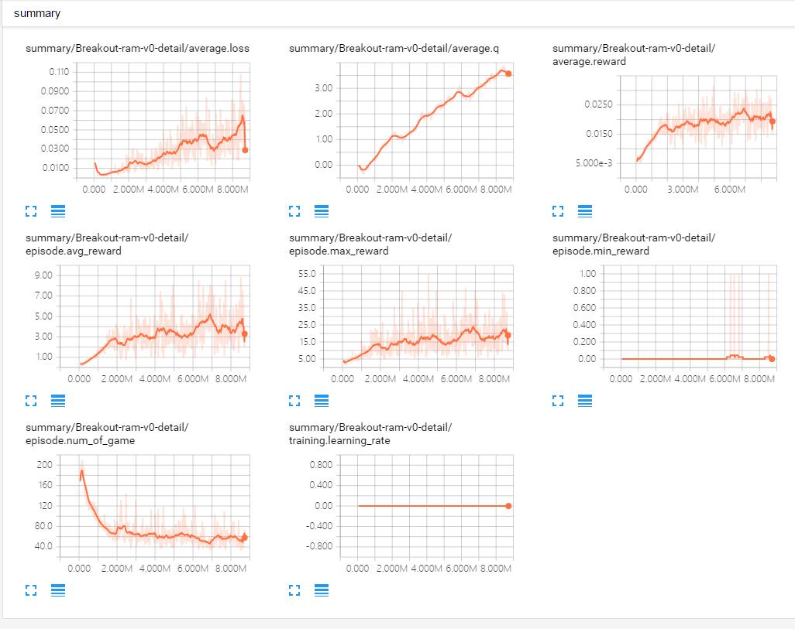
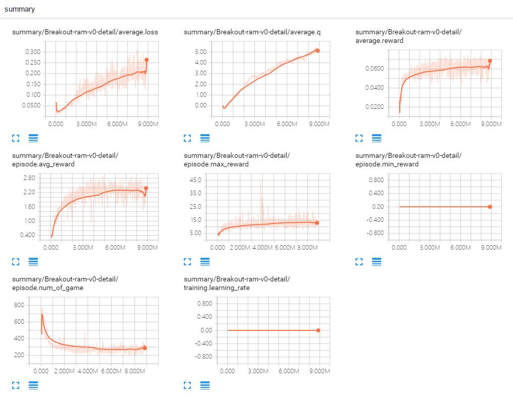

# Human-Level Control through Deep Reinforcement Learning

Tensorflow implementation of [Human-Level Control through Deep Reinforcement Learning](http://home.uchicago.edu/~arij/journalclub/papers/2015_Mnih_et_al.pdf), but the input data using the RAM state.

This implementation contains:

1. Deep Q-network and Q-learning
2. Experience replay memory
    - to reduce the correlations between consecutive updates
3. Network for Q-learning targets are fixed for intervals
    - to reduce the correlations between target and predicted Q-values

## Requirements

- Python 2.7
- [gym](https://github.com/openai/gym)
- [tqdm](https://github.com/tqdm/tqdm)
- [SciPy](http://www.scipy.org/install.html) or [OpenCV2](http://opencv.org/)
- [TensorFlow 0.12.0](https://github.com/tensorflow/tensorflow/tree/r0.12)

## Usage

First, install prerequisites with:

    $ pip install tqdm gym[all]

To train a model for Breakout:

    $ python main.py --use_gpu=False --display=False  --is_train=True --action_repeat=1 --env_name=Breakout-ram-v0

To test and record the screen with gym:

    $ python main.py --use_gpu=False --display=True --is_train=False --action_repeat=1 --env_name=Breakout-ram-v0

## Results

Result of training for 24 hours using GTX 980 ti.

## Simple Results

Details of `Breakout` with --action_repeat=1.

Details of `Breakout` with --action_repeat=4.

## References

- [DQN-tensorflow](https://github.com/devsisters/DQN-tensorflow)
- [simple_dqn](https://github.com/tambetm/simple_dqn.git)
- [Code for Human-level control through deep reinforcement learning](https://sites.google.com/a/deepmind.com/dqn/)

## License

MIT License.
